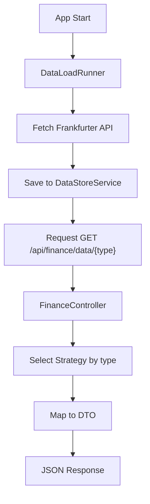

# Allotest

Layanan Spring Boot WebFlux untuk mengambil, menyimpan, dan menyajikan data kurs IDR dari Frankfurter API.

## Ringkasan

Aplikasi ini memuat 3 jenis data saat startup:
- Latest IDR rates
- Historical IDR to USD
- Supported currencies

Data disimpan di memori, lalu disajikan melalui endpoint REST dengan pendekatan strategy-based routing.

## Prasyarat

- Java 21
- Maven Wrapper (sudah tersedia di project)

## Quick Start

```bash
# install/build
./mvnw clean package

# run app
./mvnw spring-boot:run
```

Setelah jalan, coba endpoint berikut:

```bash
curl http://localhost:8080/api/finance/data/latest_idr_rates
curl http://localhost:8080/api/finance/data/historical_idr_usd
curl http://localhost:8080/api/finance/data/supported_currencies
```

## Struktur Folder

```text
allotest/
├── pom.xml
├── HELP.md
├── src/
│   ├── main/
│   │   ├── java/com/example/allotest/
│   │   │   ├── AllotestApplication.java
│   │   │   ├── client/
│   │   │   ├── config/
│   │   │   ├── constant/
│   │   │   ├── controller/
│   │   │   ├── dto/
│   │   │   ├── exception/
│   │   │   ├── runner/
│   │   │   ├── service/
│   │   │   ├── strategy/
│   │   │   └── util/
│   │   └── resources/
│   │       └── application.properties
│   └── test/java/com/example/allotest/
└── target/
```

Penjelasan folder utama:
- `client`: adapter akses API eksternal (Frankfurter).
- `config`: binding properties dan factory `WebClient`.
- `controller`: endpoint HTTP masuk.
- `strategy`: implementasi pengambilan data berdasarkan tipe request.
- `service`: penyimpanan in-memory data hasil preload.
- `runner`: proses preload data saat aplikasi startup.
- `dto`: bentuk response yang dikirim ke client.
- `exception`: global exception handler.
- `util`: utilitas tambahan (contoh kalkulasi spread).
- `test`: unit/integration test yang ada saat ini.

## Konsep Arsitektur

### 1. Strategy by data type

Controller menerima path variable `type`, lalu memilih implementasi strategy berdasarkan nama bean:
- `latest_idr_rates`
- `historical_idr_usd`
- `supported_currencies`

Dengan cara ini, penambahan tipe data baru cukup menambah strategy baru tanpa mengubah banyak logic di controller.

### 2. Startup preloading

Pada startup, `DataLoadRunner` menjalankan fetch data secara paralel menggunakan `CompletableFuture`:
- latest
- historical
- currencies

Tujuan preload adalah membuat endpoint siap melayani data cepat dari memory store.

### 3. In-memory caching

`DataStoreService` memakai `ConcurrentHashMap` untuk menyimpan data berdasarkan key. Data akan hilang ketika aplikasi restart karena tidak ada persistence database.

### 4. Reactive client, blocking handoff

External call menggunakan `WebClient` (WebFlux), namun hasil akhirnya di-`block()` saat preload. Artinya:
- komunikasi keluar tetap reactive-friendly,
- alur startup menunggu sampai data preload selesai.

### 5. Toleransi kegagalan external API

`FrankfurterClient` memiliki retry policy:
- 3 kali retry
- fixed delay 2 detik

Jika tetap gagal, startup dapat ikut gagal karena preload wajib selesai.

## Alur Data

1. Aplikasi start.
2. `DataLoadRunner` fetch data dari Frankfurter API.
3. Data disimpan ke `DataStoreService`.
4. Request masuk ke endpoint `/api/finance/data/{type}`.
5. Controller memilih strategy sesuai `type`.
6. Strategy membaca data store, mapping ke DTO, lalu return response.

### Flow Sederhana



## Endpoint API

Base path di aplikasi adalah `/api`, sehingga endpoint efektif:

### GET `/api/finance/data/{type}`

Nilai `type` yang valid:
- `latest_idr_rates`
- `historical_idr_usd`
- `supported_currencies`

Contoh request:

```bash
curl http://localhost:8080/api/finance/data/latest_idr_rates
```

Contoh response `latest_idr_rates`:

```json
{
  "base": "IDR",
  "date": "2026-01-05",
  "rates": {
    "USD": 0.000061
  },
  "usdBuySpreadIdr": 16472.95
}
```

Contoh response `historical_idr_usd`:

```json
{
  "base": "IDR",
  "retes": {
    "2026-01-01": {
      "USD": 0.000061
    }
  }
}
```

Contoh response `supported_currencies`:

```json
{
  "curencies": {
    "USD": "United States Dollar",
    "EUR": "Euro"
  }
}
```

Catatan: nama field `retes` dan `curencies` mengikuti DTO saat ini.

## Konfigurasi

File konfigurasi utama: `src/main/resources/application.properties`

Default:

```properties
spring.application.name=allotest
spring.webflux.base-path=/api
allotest.apps.external-url=https://api.frankfurter.dev/v1
```

Override external URL bisa lewat environment variable:

```bash
export ALLOTEST_APPS_EXTERNAL_URL=https://api.frankfurter.dev/v1
```

Atau JVM system property:

```bash
./mvnw spring-boot:run -Dspring-boot.run.jvmArguments="-Dallotest.apps.external-url=https://api.frankfurter.dev/v1"
```

## Error Handling

Global exception handler mengembalikan format:

```json
{
  "error": "message"
}
```

Kasus umum:
- `type` tidak valid -> `Invalid data type: ...`
- key data tidak ada di store -> `Data not found for key: ...`

## Testing

Jalankan semua test:

```bash
./mvnw test
```

Test yang sudah ada:
- context load + validasi preload key data
- strategy test untuk latest/historical/currency (assert non-null hasil mapping)

## Batasan Saat Ini

- Penyimpanan masih in-memory (tidak persisten).
- Data dimuat sekali saat startup (tidak ada scheduler refresh).
- Spread calculation memakai input hardcoded (`WahyuGiri04`).
- Belum ada integration test endpoint controller dan test retry behavior client secara eksplisit.

## Pengembangan Lanjutan (Opsional)

- Tambah endpoint health/readiness khusus preload status.
- Tambah scheduler untuk refresh data berkala.
- Tambah persistence layer (Redis/DB) bila ingin survive restart.
- Tambah integration test untuk endpoint dan error scenarios.
