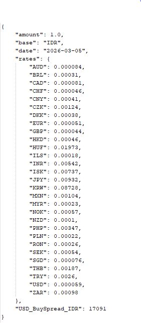
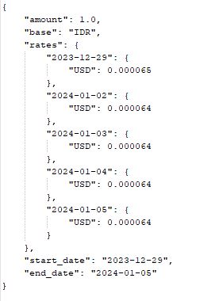
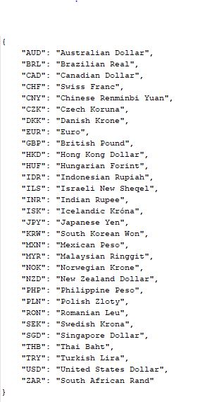

# Getting Started

### Description
Internal API Endpoint
this project one single endpoint Latest IDR Rates, Historical IDR USD, Supported Currencies.

1. Latest IDR Rates - GET /api/finance/data/{resourceType} | GET /api/finance/data/latest_idr_rates

2. Historical IDR-USD Rates - GET /api/finance/data/{resourceType} | GET /api/finance/data/historical_idr_usd

3. Supported Currencies - GET /api/finance/data/{resourceType} | GET /api/finance/data/supported_currencies

Endpoint Usage: 
1. localhost:8080/api/finance/data/latest_idr_rates

2. localhost:8080/api/finance/data/historical_idr_usd

3. localhost:8080/api/finance/data/supported_currencies

Personalization Note: 

GitHub username : ifane-dev

Spread Factor: 0.00834

Architectural Rationale 

Polymorphism Justification: 
Strategy pattern used it encapsulated resource specific logic into separate classes,
avoids large conditional blocks, improves maintainability, and supports future
extentions without modifying existing code.

Client Factory: 
The factory bean acts as a centralized constructor and configuration provider for the external API Client

Startup Runner Choice:
ApplicationRunner runs after the spring boot application has been completely initialized.
@PostConstruct runs immediately after a bean is created, which may occur before the entire application is full ready.
