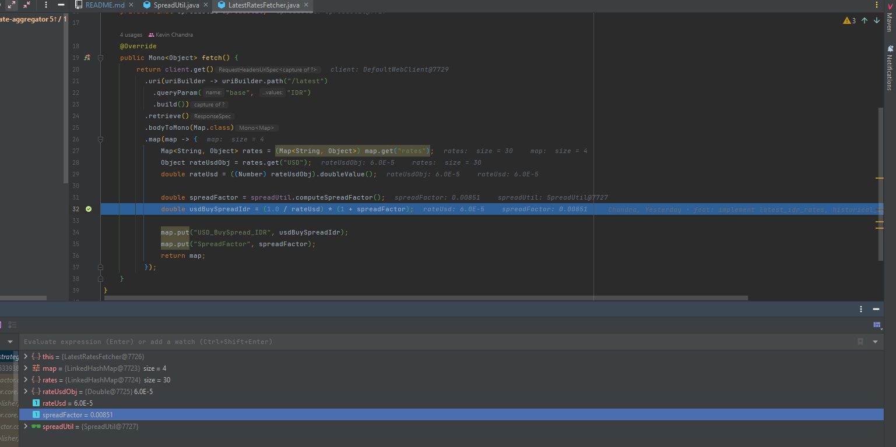

# Allo Bank – Backend Developer Take-Home Test
Java 17 • Spring Boot 3 • Reactive WebFlux • Strategy Pattern • Startup Preloading

This project fulfills the Allo Bank Backend Developer take-home requirements by fetching external currency data using WebFlux, preloading it at application startup, storing it in an immutable in-memory cache, and exposing REST APIs to retrieve the preloaded values.

---

## 1. Features

### Preloading External API Data at Startup
The application uses `ApplicationRunner` to:
- Execute **three different data fetcher strategies**
- Call the Frankfurter external API once only (no repeated calls per HTTP request)
- Store results in a **thread-safe, immutable in-memory store**

### Strategy Pattern (3 services)
Each resource is loaded using its own strategy:
- `latest_idr_rates`
- `historical_idr_usd`
- `supported_currencies`

### Personalized Financial Spread Factor
The spread value is unique to the developer, based on GitHub username.

### WebFlux Non-Blocking API Client
Uses `WebClient` with:
- Configurable base URL
- Configurable timeout
- Auto-bound configuration properties

### Production-Quality Implementation
- Clean architecture
- Error handling for network failures
- Unit & integration tests
- Clear documentation

---

## 2. Setup & Installation

### Clone the repository
```bash
git clone https://github.com/kevinch38/allo-backend-test.git
cd allo-backend-test
```
### Build the app
```bash
mvn clean install
```
### Run the application
```bash
mvn spring-boot:run
```
### Run all tests
```bash
mvn test
```

## 3. Configuration
### The application reads settings from application.properties
```properties
spring.application.name=allobank

app.frankfurter.base-url=https://api.frankfurter.app
app.frankfurter.timeout-ms=5000

app.personalization.github-username=kevinch38
```

## 4. API Usage
### GET `/api/finance/data/{resourceType}`
| Resource Type        | Description                                                 |
|----------------------|-------------------------------------------------------------|
| latest_idr_rates     | Latest IDR data + personalized USD_BuySpread_IDR            |
| historical_idr_usd   | 30-day historical rate of USD when base=IDR                 |
| supported_currencies | List of all supported currency symbols from Frankfurter API |

### Example Requests
### Latest IDR Rates
```bash
curl http://localhost:8080/api/finance/data/latest_idr_rates
```
### Historical IDR→USD
```bash
curl http://localhost:8080/api/finance/data/historical_idr_usd
```
### Supported Currencies
```cmd
curl http://localhost:8080/api/finance/data/supported_currencies
```

## 5. Personalization: Spread Factor Calculation
### Username
```
kevinch38
```
### ASCII Value Sum
```
k (107)
e (101)
v (118)
i (105)
n (110)
c (99)
h (104)
3 (51)
8 (56)
------------------
Total: 851
```
### Spread Factor Formula
```mathematica
Spread Factor = (ASCII Sum % 1000) / 100000.0
= 851 / 100000.0
= 0.00851
```


### Usage
This spread factor affects:
- USD_BuySpread_IDR (Latest IDR Rates)

## 6. Personalization: Spread Factor Calculation
### Layers
| Layer        | Responsibility                                           |
|--------------|----------------------------------------------------------|
| `config`     | WebClient configuration, external API properties binding |
| `constant`   | Static constant values                                   |
| `controller` | REST API endpoints                                       |
| `dto`        | DTOs for request/response/internal data models           |
| `runner`     | Application startup data loader                          |
| `strategy`   | Strategy implementations for the three resource fetchers |
| `util`       | Utility classes (e.g., Spread factor calculator)         |
| `service`    | In-memory data store (cache for API results)             |


### Startup Flow
```
ApplicationRunner → executes 3 fetchers → loads results → stores in-memory → API serves the preloaded cache
```
In-Memory Data Store
- Thread-safe
- Immutable once loaded

## 7. Testing
### Unit Tests
Covers:
- LatestRatesFetcher
- HistoricalUsdFetcher
- SupportedCurrenciesFetcher

### Integration Tests
Ensures:
- ApplicationRunner preloads the store
- Controller returns existing cached data
- Startup fails cleanly on fatal external API issues

## 8. Error Handling
The application gracefully handles:
- Timeout
- Invalid responses
- 4xx/5xx errors

### Each fetcher returns:
```json
{
  "error": "failed to load",
  "message": "<exception message>"
}
```
And the application continues startup with partial data.

## 9. Contact
### Created by Kevin (kevinch38)
### Java Backend Engineer • Spring Boot Specialist
