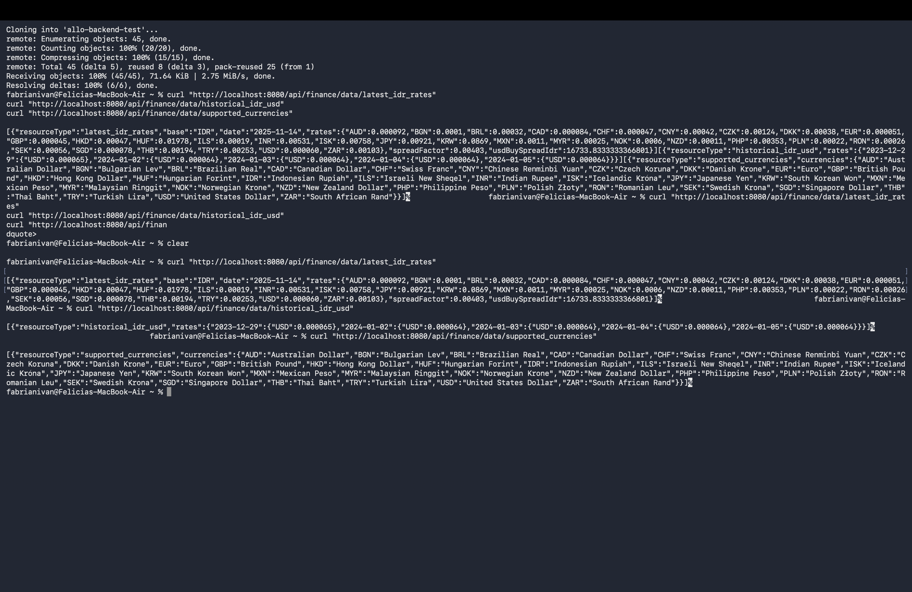

# Allo Bank Backend Developer — Take-Home Test

Repository ini adalah hasil implementasi tugas take-home test Allo Bank Backend Developer.  
Aplikasi dibangun dengan prinsip clean, modular, thread-safe, dan mengikuti arsitektur yang diminta oleh soal (Strategy Pattern, FactoryBean, preload data di startup).

---

## Ringkasan
- Semua data dari Frankfurter Exchange Rate API diambil satu kali saat aplikasi dijalankan.
- Data disimpan di in-memory store yang immutable dan thread-safe.
- Data disajikan lewat satu endpoint REST dengan beberapa resource berbeda.
- WebClient dibuat melalui `FrankfurterClientFactoryBean` (tidak menggunakan `@Bean` untuk WebClient).

---

## Fitur yang Diimplementasikan
Endpoint tunggal:
- GET /api/finance/data/{resourceType}

resourceType:
- `latest_idr_rates`
- `historical_idr_usd`
- `supported_currencies`

Integrasi dengan Frankfurter API:
- `/latest?base=IDR`
- `/2024-01-01..2024-01-05?from=IDR&to=USD`
- `/currencies`

Setiap resource ditangani oleh strategy terpisah yang mengimplementasikan `IdrDataFetcher`.  
Semua output API dikembalikan sebagai array JSON (format : [ { ... } ]).

---

## Struktur Proyek
src/main/java/com/allobank/allobackendtest
```
 ├─ config/
 │    └─ FrankfurterClientFactoryBean.java
 ├─ controller/
 │    └─ FinanceController.java
 ├─ dto/
 │    ├─ LatestRatesResponse.java
 │    ├─ HistoricalRatesResponse.java
 │    └─ CurrenciesResponse.java
 ├─ service/
 │    ├─ DataPreloadRunner.java
 │    └─ InMemoryFinanceStore.java
 ├─ strategy/
 │    ├─ IdrDataFetcher.java
 │    ├─ LatestIdrRatesFetcher.java
 │    ├─ HistoricalIdrUsdFetcher.java
 │    └─ SupportedCurrenciesFetcher.java
 └─ util/
    └─ SpreadFactorCalculator.java
```

---

## Menjalankan Aplikasi
1. Clone repository
```bash
git clone https://github.com/fabrianivan-id/allo-backend-test
cd allo-backend-test
```
2. Checkout branch kerja
```bash
git checkout -b feat/idr-rate-aggregator
```
3. Build
```bash
mvn clean install
```
4. Jalankan
```bash
mvn spring-boot:run
```
Aplikasi berjalan di: http://localhost:8080

---

## Cara Menguji Endpoint
1. Data terbaru IDR dan spread
```bash
curl "http://localhost:8080/api/finance/data/latest_idr_rates"
```
2. Data historis IDR → USD
```bash
curl "http://localhost:8080/api/finance/data/historical_idr_usd"
```
3. Daftar mata uang yang didukung
```bash
curl "http://localhost:8080/api/finance/data/supported_currencies"
```

---

## Screenshot Hasil Pengujian
File screenshot ada di root repository:
- `screenshot.png`  


---

## Perhitungan Spread Factor (Personalized)
- Username GitHub: `fabrianivan`
- Rumus:
  - sum = jumlah ASCII setiap karakter username (lowercase)
  - SpreadFactor = (sum % 1000) / 100000.0
- Hasil yang digunakan:
  - SpreadFactor = 0.00153
- Rumus final:
  - USD_BuySpread_IDR = (1 / Rate_USD) * (1 + SpreadFactor)

---

## Penjelasan Arsitektur (Rationale)
1. Strategy Pattern
   - Memisahkan logika pengambilan/transformasi pada setiap resource.
   - Menghindari if/else di controller, agar memudahkan penambahan resource dan pengujian unit.
2. FactoryBean untuk WebClient
   - Constraint tes: WebClient tidak boleh dibuat dengan menggunakan `@Bean`.
   - FactoryBean memberi kontrol pembuatan instance WebClient dan konfigurasi terpusat.
3. ApplicationRunner untuk preload data
   - Menjalankan preload setelah Spring context lengkap.
   - Menghindari isu eksekusi lebih awal (dibanding `@PostConstruct`).

---

## Thread-safety & Immutability
- Data disimpan di `InMemoryFinanceStore` menggunakan `AtomicReference`.
- Salinan data dibuat dengan `Map.copyOf()` untuk memastikan immutability.
- Data hanya dimuat sekali saat startup; permintaan API membaca dari memory tanpa memanggil ulang API eksternal.

---

## Pengujian
- Unit tests untuk tiap strategy (mock WebClient) dan `SpreadFactorCalculator`.
- Integration test memastikan `DataPreloadRunner` berjalan di startup dan `InMemoryFinanceStore` terisi sebelum request pertama.

---