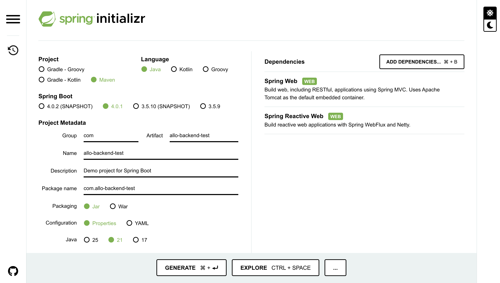
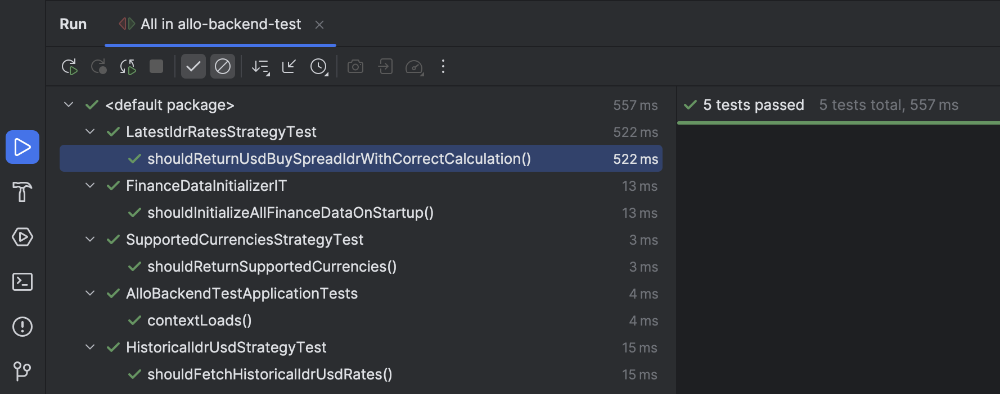

# Allo BE – Spring Boot Application

Backend service built using **Java Spring Boot**.

---

## Prerequisites
Make sure the following environments are installed:

- Java JDK 21
- IntelliJ IDEA (Community)

Check Version Java:
```terminal
java -version
```

## Setup Project
### 1. [Create New Project Spring Boot using Spring Initializr](https://start.spring.io/)


### 2. Clone Project
- Open [Github](https://github.com/allobankdev/allo-backend-test)
- Copy Project, using Click Button Fork
- Open Fork Project and copy HTTPS/SSH clone
- Open the folder you want to use as a repository, then open the terminal. example:
```terminal
https://github.com/Happid/allo-backend-test.git
```
- Entry to your root folder. example: `YOUR_FOLDER/allo-backend-test`
- Open your terminal and create new branch
```terminal
git checkout -b "feat/idr-rate-aggregator"
```
- After that check all the branches
```terminal
git branch
```
- Make sure showing the branch and you inside the `feat/idr-rate-aggregator`.

### 3. Integration git to your new project
- After downloading your new project, copy and paste the project inside the `YOUR_FOLDER/allo-backend-test`
- For check the changes
```terminal
git status
```
- For comment what you do in the changes
```terminal
git add .
git commit -m "YOUR_COMMENT"
```
- For push or update the repository
```terminal
git push --set-upstream origin feat/idr-rate-aggregator
```

## Run Instruction (IDE - Intellij CE)
### 1. Run for dev
- Open project using Intellij
- Open file : `allo-backend-test/src/main/java/AlloBackendTestApplication.java`
- Click button `▶ Run`, next to the main method

### 2. Run for testing
- Open project using Intellij
- In The Folder : `allo-backend-test/src/test/java`
- Right Click `▶ Run 'All Test'`


### 3. For build
- In the top of menu choose `Buid` -> `Build Project`
- Wait until done

## Endpoint Usage
- Make Sure your Java Spring Boot it's running. This 3 endpoint:
- http://localhost:8080/api/finance/data/latest_idr_rates
- http://localhost:8080/api/finance/data/historical_idr_usd
- http://localhost:8080/api/finance/data/supported_currencies

## Personalization Note
- GitHub Username: **Happid**
- Spread Factor (calculated): **0.0063**

This Spread factor is calculated automatically by the 
application based on the sum of the Unicode values
of each character in the GitHub username,
according to the rules described in the requirements.

## Architectural Rationale
### i. Polymorphism Justification
The Strategy Pattern is used to handle multiple resource 
types within a single endpoint without using if-else or switch patterns. 
Each resource is implemented as a separate strategy, 
making code easier to develop and maintain. When a new resource is added, 
simply add a new strategy without changing existing controllers or services.

### ii. Client Factory
External API clients are created using FactoryBean to centralize and 
control the client creation and configuration process. 
This approach provides more flexibility than a standard 
@Bean, particularly for lifecycle management, initial configuration, 
and subsequent development without impacting business logic.

### iii. Startup Runner Choice
ApplicationRunner is used to fetch external data once at startup 
because it runs after the entire Spring Context is ready.
This approach is safer than @PostConstruct and ensures the data 
is complete, immutable, and ready to use before the endpoint receives 
the request.